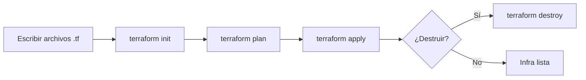

# ¿Qué es Terraform?

Terraform es una herramienta de **infraestructura como código** (IaC) desarrollada por HashiCorp. Permite definir, provisionar y gestionar infraestructura en la nube (y on-premise) usando archivos de configuración legibles y versionables.

**En una frase:**

> Terraform te permite describir la infraestructura como si fuera código, para crear y administrar recursos de manera automatizada y repetible.

## Modelo de negocio, valor y licencia

- **Licencia:**
  Open Source bajo licencia MPL 2.0 (Mozilla Public License).
  Hay versiones comerciales (Terraform Cloud, Terraform Enterprise) con más features empresariales.

- **Modelo de negocio:**

  - Gratuito: Terraform CLI (local)
  - SaaS: Terraform Cloud (colaboración, estado remoto, control de acceso, etc.)
  - Enterprise: Para grandes empresas, integración con sistemas corporativos y soporte.

- **Valor diferencial:**

  - Independencia de proveedores (multi-cloud)
  - Declarativo y reproducible
  - Gestión del ciclo de vida de la infraestructura (crea, actualiza, destruye)
  - Comunidad gigante y cientos de _providers_.

## ¿Cómo nació Terraform?

- **Creado por HashiCorp** en 2014.
- Surgió como respuesta a la necesidad de gestionar infraestructura en múltiples nubes desde un solo lugar, con enfoque en IaC (cuando ya existían Chef, Puppet y Ansible, pero orientados más a configuración que a infraestructura base).
- HashiCorp ya tenía herramientas como Vagrant (máquinas virtuales locales), pero Terraform fue el salto a la gestión cloud.

## ¿Qué otros servicios ofrece HashiCorp? ¿Qué abarca el ecosistema de Terraform?

HashiCorp es una fábrica de herramientas para DevOps e infraestructura, no solo Terraform. Algunas relevantes:

- **Vagrant:** Provisión de entornos de desarrollo locales.
- **Consul:** Descubrimiento y configuración de servicios.
- **Vault:** Gestión de secretos y cifrado.
- **Nomad:** Orquestación de aplicaciones.
- **Packer:** Creación de imágenes de máquinas.
- **Boundary:** Acceso seguro a infraestructura.

**Terraform**, en particular, soporta:

- AWS, Azure, GCP, DigitalOcean, VMware, Alibaba, Oracle Cloud y más.
- Proveedores de SaaS: GitHub, Cloudflare, Datadog, etc.

## ¿Cómo funciona Terraform?

Terraform sigue un modelo **declarativo**:
Tú describes el “estado deseado” de la infraestructura y Terraform se encarga de alcanzar ese estado, ejecutando los cambios necesarios.

**Componentes clave:**

- **Providers:** Plugins para interactuar con APIs de servicios (AWS, Azure, GCP, etc.).
- **Resources:** Objetos que quieres crear, como instancias EC2, buckets S3, etc.
- **Modules:** Agrupaciones reutilizables de recursos.

## Etapas del ciclo de vida en Terraform

1. **Write (Escritura):**
   Escribes archivos `.tf` con la infraestructura deseada.
2. **Init (Inicialización):**
   Inicializas el directorio de trabajo, descargas providers, módulos, etc.
3. **Plan (Planificación):**
   Terraform muestra qué acciones realizará para lograr el estado deseado (sin aplicar cambios aún).
4. **Apply (Aplicación):**
   Ejecuta los cambios en la infraestructura real.
5. **Destroy (Destrucción):**
   Elimina toda la infraestructura creada.

## Diagrama Mermaid de las etapas de Terraform



## Distribución de la sintaxis: ejemplo sencillo

La sintaxis de Terraform se llama **HCL (HashiCorp Configuration Language)**. Es sencilla y legible, tipo JSON pero más flexible.

**Ejemplo: Crear una instancia EC2 en AWS**

```hcl
provider "aws" {
  region = "us-east-1"
}

resource "aws_instance" "ejemplo" {
  ami           = "ami-0c6ebb5b9bce4ba15"
  instance_type = "t2.micro"
}
```

**Explicación:**

- `provider "aws"`: Configura el proveedor (qué nube usar).
- `resource "aws_instance" "ejemplo"`: Crea un recurso tipo EC2, con los parámetros indicados.
- Los valores se pueden parametrizar, interpolar, y combinar con variables y outputs.

## Tabla de comandos clave de Terraform

| Comando               | Descripción breve                                                   | Uso principal                                          |
| --------------------- | ------------------------------------------------------------------- | ------------------------------------------------------ |
| `terraform init`      | Inicializa el directorio de trabajo y descarga providers y módulos. | **Siempre primero**, preparar el entorno.              |
| `terraform validate`  | Valida que la configuración `.tf` sea sintácticamente correcta.     | Revisar errores antes de ejecutar cambios.             |
| `terraform fmt`       | Formatea los archivos `.tf` con estilo estándar.                    | Ordenar y limpiar el código.                           |
| `terraform plan`      | Muestra los cambios que Terraform va a realizar (previo a aplicar). | Verificar antes de aplicar cambios.                    |
| `terraform apply`     | Aplica los cambios y crea/actualiza los recursos definidos.         | Crear, modificar o actualizar infraestructura.         |
| `terraform destroy`   | Elimina todos los recursos definidos en la configuración.           | **Destruir** recursos de forma controlada.             |
| `terraform output`    | Muestra los valores de salida definidos en la configuración.        | Ver resultados o endpoints generados.                  |
| `terraform state`     | Permite inspeccionar o modificar el estado de los recursos.         | Diagnóstico avanzado o reparaciones.                   |
| `terraform show`      | Muestra el estado actual o un plan de ejecución en formato legible. | Ver resumen del estado real.                           |
| `terraform providers` | Lista los proveedores usados y sus versiones.                       | Auditoría y troubleshooting.                           |
| `terraform import`    | Añade recursos existentes fuera de Terraform al estado.             | Adoptar recursos creados manualmente.                  |
| `terraform taint`     | Marca un recurso para ser destruido y recreado en el próximo apply. | Forzar recreación.                                     |
| `terraform untaint`   | Elimina el “taint” de un recurso.                                   | Quitar marca de recreación.                            |
| `terraform graph`     | Genera un gráfico de dependencias de recursos en formato DOT.       | Visualización avanzada (usando herramientas externas). |
| `terraform version`   | Muestra la versión de Terraform instalada.                          | Verificar compatibilidad.                              |
| `terraform help`      | Muestra ayuda general o de un comando específico.                   | Consulta rápida sobre comandos.                        |

## Tabla de sintaxis esencial de Terraform

| Bloque/Sintaxis     | ¿Para qué sirve?                           | Ejemplo mínimo                                                                       |
| ------------------- | ------------------------------------------ | ------------------------------------------------------------------------------------ |
| `provider`          | Configura el proveedor (cloud/local/etc)   | `hcl<br>provider "aws" { region = "us-east-1" }<br>`                                 |
| `resource`          | Declara un recurso a gestionar             | `hcl<br>resource "local_file" "ejemplo" { filename = "x.txt" content = "Hola" }<br>` |
| `variable`          | Define una variable reutilizable           | `hcl<br>variable "nombre" { type = string default = "Estudiante" }<br>`              |
| `output`            | Expone un valor de salida                  | `hcl<br>output "saludo" { value = var.nombre }<br>`                                  |
| `data`              | Consulta información externa (data source) | `hcl<br>data "aws_ami" "ubuntu" { most_recent = true ... }<br>`                      |
| `module`            | Usa un módulo reutilizable                 | `hcl<br>module "vpc" { source = "terraform-aws-modules/vpc/aws" ... }<br>`           |
| `locals`            | Define valores locales calculados          | `hcl<br>locals { mensaje = "Hola, ${var.nombre}" }<br>`                              |
| `depends_on`        | Forzar dependencias entre recursos         | `hcl<br>resource "x" "a" { ... depends_on = [resource.y.b] }<br>`                    |
| `terraform`         | Configuración de backend y versiones       | `hcl<br>terraform { required_version = ">= 1.0.0" }<br>`                             |
| Interpolación `${}` | Insertar variables o expresiones           | `hcl<br>content = "Hola, ${var.nombre}"<br>`                                         |
| Comentario          | Documentar el código                       | `hcl<br># Esto es un comentario<br>// También válido<br>`                            |

## Archivos generados por Terraform y su función

### 1. `terraform.tfstate`

- **¿Qué es?**
  Es el archivo **más importante** de Terraform.
  Guarda el **estado actual** de la infraestructura gestionada por Terraform.
- **¿Para qué sirve?**
  Permite que Terraform sepa qué recursos existen, sus atributos, relaciones y cambios.
  Así puede comparar el "deseado" (definido en `.tf`) vs el "real" (en la nube/local).
- **¿Qué contiene?**
  Un JSON con información detallada de todos los recursos creados, IDs, direcciones, metadatos, etc.
- **¿Qué debes saber?**
  **¡Nunca lo edites a mano!** Si lo pierdes, Terraform "olvida" la infraestructura y podrías tener problemas de drift (desincronización).
  En proyectos serios, se almacena de forma remota (ejemplo: en S3 para trabajo en equipo).

### 2. `terraform.tfstate.backup`

- **¿Qué es?**
  Es una **copia de seguridad** automática del estado anterior cada vez que Terraform modifica el estado.
- **¿Para qué sirve?**
  Si algo sale mal, puedes recuperar el estado previo y evitar pérdida o corrupción.
- **¿Qué contiene?**
  Básicamente, el contenido anterior del archivo `terraform.tfstate`.
- **¿Qué debes saber?**
  Normalmente se ignora (se pone en `.gitignore`), salvo que debas restaurar el estado.

### 3. `.terraform/` (directorio oculto)

- **¿Qué es?**
  Un directorio que contiene **los plugins descargados** (providers) y archivos internos de control.
- **¿Para qué sirve?**
  Almacena los binarios y metadatos de los providers (ej: AWS, Docker, local, etc), y archivos de lock.
- **¿Qué contiene?**

  - Subcarpetas con los providers y módulos.
  - Archivos internos como `providers`, `modules.json`.

- **¿Qué debes saber?**
  No lo toques ni lo subas al repo. Si tienes problemas con providers, puedes borrar este directorio y correr `terraform init` de nuevo.

### 4. `.terraform.lock.hcl`

- **¿Qué es?**
  Archivo de **lock** de versiones de providers (como un package-lock).
- **¿Para qué sirve?**
  Fija la versión de los providers usados para garantizar que todos trabajen con la misma versión.
- **¿Qué contiene?**
  Nombres, versiones y hashes de los providers usados en el proyecto.
- **¿Qué debes saber?**
  Es bueno **sí subirlo** al repo (control de versiones).

## ¿Qué archivos nunca subir a Git?

- `terraform.tfstate`
- `terraform.tfstate.backup`
- `.terraform/`

**Solo sube:**

- Tus archivos `.tf`
- `.terraform.lock.hcl`

Puedes usar este `.gitignore`:

```bash
.terraform*.tfsta
*.tfstate.backup
```
