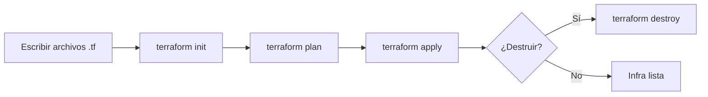

# terraform-app

Guía práctica y progresiva para aprender **Terraform** (infraestructura como
código) en español, con demos ejecutables y documentación de referencia.


## Tabla de Contenidos

- [Descripción](#descripción)
- [Características](#características)
- [Requisitos Previos](#requisitos-previos)
- [Instalación](#instalación)
- [Uso](#uso)
- [Comandos de Terraform](#comandos-de-terraform)
- [Arquitectura](#arquitectura)
- [Stack Tecnológico](#stack-tecnológico)
- [Documentación](#documentación)
- [Contribución](#contribución)
- [Roadmap](#roadmap)
- [Versionado](#versionado)
- [Autores](#autores)
- [Licencia](#licencia)
- [Apóyanos](#apóyanos)
- [Agradecimientos](#agradecimientos)

## Descripción

`terraform-app` es un repositorio educativo que enseña Terraform desde lo más
simple (crear un archivo local) hasta infraestructura en la nube (EC2 + S3 + RDS
en AWS). Cada ejercicio vive en su propia carpeta con su configuración y su
estado aislados, y la teoría se documenta aparte en [`docs/`](docs/README.md).

Si es tu primer contacto con Terraform, empieza por
[`docs/reference/terraform-basics.md`](docs/reference/terraform-basics.md).

### Ciclo de vida de Terraform



## Características

- ✅ Demo local sin nube (`terraform-html-demo`, provider `local`).
- ✅ Demo de contenedores (`terraform-docker-demo`, provider `docker`).
- ✅ Guía de AWS (`terraform-aws-demo`, EC2 + S3 + RDS).
- ✅ Referencia conceptual: conceptos, comandos, sintaxis HCL y archivos de estado.
- ✅ Validación automática de formato y sintaxis en CI.
- 📋 Estado remoto y módulos reutilizables (ver [Roadmap](#roadmap)).

## Requisitos Previos

- **Terraform CLI**: v1.0.0 o superior — `terraform -v`
- **Git**: recomendado
- **Docker**: solo para `terraform-docker-demo` — `docker version`
- **Cuenta AWS + AWS CLI**: solo para `terraform-aws-demo`

## Instalación

```bash
git clone https://github.com/brayandiazc/terraform-app.git
cd terraform-app
```

No hay dependencias que instalar a nivel de repositorio: cada demo descarga sus
_providers_ con `terraform init`.

## Uso

Cada demo se ejecuta desde su propia carpeta. El flujo es siempre el mismo:
`init → plan → apply` y, al terminar, `destroy`.

### 1. `terraform-html-demo` — archivo local (la más simple)

```bash
cd terraform-html-demo
terraform init
terraform plan
terraform apply     # confirma con "yes" → genera index.html
terraform destroy   # limpia
```

Guía paso a paso: [`terraform-html-demo/terraform-html-demo.md`](terraform-html-demo/terraform-html-demo.md).

### 2. `terraform-docker-demo` — contenedor Nginx (requiere Docker)

```bash
cd terraform-docker-demo
terraform init
terraform apply     # levanta el contenedor → http://localhost:8080
terraform destroy
```

Guía paso a paso: [`terraform-docker-demo/terraform-docker-demo.md`](terraform-docker-demo/terraform-docker-demo.md).

### 3. `terraform-aws-demo` — EC2 + S3 + RDS (requiere cuenta AWS)

Guía de referencia (⚠️ genera costos reales en AWS):
[`terraform-aws-demo/terraform-aws-demo.md`](terraform-aws-demo/terraform-aws-demo.md).

> El ciclo de vida detallado (reglas, rollback y verificación) está en
> [`docs/conventions/deploy.md`](docs/conventions/deploy.md).

## Comandos de Terraform

```bash
terraform init       # Inicializa y descarga providers
terraform fmt        # Formatea el HCL
terraform validate   # Valida la sintaxis
terraform plan       # Muestra los cambios sin aplicarlos
terraform apply      # Aplica los cambios
terraform destroy    # Elimina los recursos
```

Tabla completa en [`docs/reference/commands.md`](docs/reference/commands.md).

## Arquitectura

Cada ejercicio es independiente y mantiene su propio estado. Detalle en
[`docs/architecture/architecture.md`](docs/architecture/architecture.md).

## Stack Tecnológico

Terraform CLI (>= 1.0) + providers `local`, `docker` y `aws`. Inventario completo
con versiones en [`docs/architecture/stack.md`](docs/architecture/stack.md).

## Documentación

Toda la documentación vive en [`docs/`](docs/README.md):

| Documento                                                            | Responde a                              |
| ------------------------------------------------------------------- | --------------------------------------- |
| [`docs/reference/`](docs/reference/README.md)                       | ¿Qué es Terraform y cómo se usa?        |
| [`docs/architecture/architecture.md`](docs/architecture/architecture.md) | ¿Cómo está organizado el repo?     |
| [`docs/architecture/stack.md`](docs/architecture/stack.md)          | ¿Con qué versiones y providers?         |
| [`docs/conventions/`](docs/conventions/README.md)                   | ¿Cómo trabajamos en este repo?          |
| [`docs/decisions/`](docs/decisions/README.md)                       | ¿Por qué tomamos cada decisión?         |
| [`docs/product/roadmap.md`](docs/product/roadmap.md)                | ¿Hacia dónde va?                        |
| [`docs/glossary.md`](docs/glossary.md)                              | ¿Qué significa cada término?            |

## Contribución

Lee la [Guía de Contribución](CONTRIBUTING.md) para conocer el flujo de trabajo
(Git Flow), el formato de commits (Conventional Commits) y el proceso de Pull
Requests. Antes de abrir un PR, ejecuta:

```bash
terraform fmt -recursive
terraform validate
```

## Roadmap

Visión y próximos pasos en [`docs/product/roadmap.md`](docs/product/roadmap.md).

## Versionado

Usamos [Git](https://git-scm.com) para el control de versiones y seguimos
[Semantic Versioning](https://semver.org/). Consulta las
[etiquetas](https://github.com/brayandiazc/terraform-app/tags) para ver las
versiones disponibles y el [CHANGELOG](CHANGELOG.md).

## Autores

- **Brayan Diaz C** — _Trabajo inicial_ — [@brayandiazc](https://github.com/brayandiazc)

Consulta también la lista de
[contribuidores](https://github.com/brayandiazc/terraform-app/contributors).

## Licencia

Este proyecto está bajo la licencia [MIT](LICENSE).

## Apóyanos

Si este proyecto te resulta útil y quieres apoyar su desarrollo:

- [GitHub Sponsors](https://github.com/sponsors/brayandiazc)

## Agradecimientos

Gracias a quienes contribuyen a este proyecto. Si encuentras valor en él, puedes:

- Compartir el proyecto 📤
- Invitar un café ☕
- Abrir un issue o PR 🙌
- Dejar tu agradecimiento con un comentario 💬

---

⌨️ con ❤️ por [@brayandiazc](https://github.com/brayandiazc)
