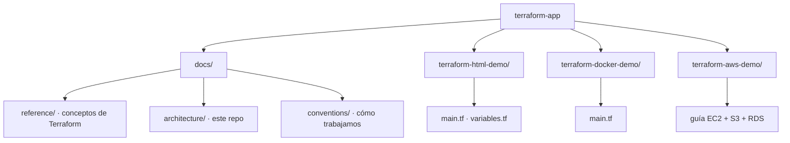

# terraform-app — Arquitectura

> Vista de alto nivel de cómo está **organizado** este repositorio. No es una
> aplicación desplegable, sino una colección de demos y material de referencia
> para aprender Terraform. Para las versiones y providers ver [`stack.md`](stack.md).
>
> **Última actualización**: 2026-07-02

## Estructura del repositorio

## Componentes

| Componente             | Responsabilidad                                             | Tecnología           |
| ---------------------- | ---------------------------------------------------------- | -------------------- |
| `terraform-html-demo`  | Genera un archivo `index.html` local con una variable.     | Provider `local`     |
| `terraform-docker-demo`| Levanta un contenedor Nginx local.                         | Provider `docker`    |
| `terraform-aws-demo`   | Guía (sin `.tf`) para EC2 + S3 + RDS + outputs.            | Provider `aws`       |
| `docs/`                | Documentación: referencia, arquitectura y convenciones.    | Markdown             |

## Grado de complejidad de las demos

Las demos están ordenadas por dificultad creciente:

1. **`terraform-html-demo`** — la más simple: un solo recurso `local_file`, sin
   nube ni credenciales. Ideal para el primer contacto.
2. **`terraform-docker-demo`** — recursos con dependencias (`docker_image` →
   `docker_container`); requiere Docker corriendo localmente.
3. **`terraform-aws-demo`** — la más completa: EC2, S3, RDS, security groups,
   outputs y archivo local. Se documenta como guía; ejecutarla implica costos en
   AWS y credenciales reales.

## Decisiones clave

| Decisión                                             | Razón                                                     |
| ---------------------------------------------------- | --------------------------------------------------------- |
| Separar cada ejercicio en su propia carpeta          | Cada demo tiene su propio estado y providers, aislados.   |
| No versionar estado ni `.terraform/`                 | El estado es local y puede contener datos sensibles.      |
| Versionar `.terraform.lock.hcl`                      | Fija versiones de providers para builds reproducibles.    |
| Adoptar la plantilla de documentación                | Estandarizar gobernanza y estructura. Ver ADR-0002.       |

> El detalle de cada decisión relevante se registra como ADR en
> [`../decisions/`](../decisions/README.md).

## Reglas no negociables

- Nunca commitear `terraform.tfstate`, `terraform.tfstate.backup`, `.terraform/`
  ni archivos `*.tfvars` con secretos.
- Todo el HCL debe pasar `terraform fmt` y `terraform validate` antes del merge.

## Referencias

- [`stack.md`](stack.md) — versiones y providers.
- [`../reference/terraform-basics.md`](../reference/terraform-basics.md) — conceptos de Terraform.
- [`../conventions/`](../conventions/README.md) — convenciones de trabajo.
