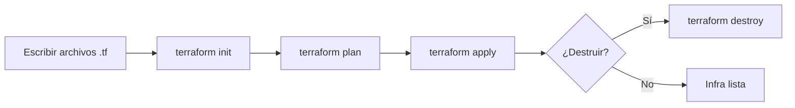

# ¿Qué es Terraform?

> Referencia conceptual: qué es Terraform, de dónde viene y cómo funciona.
> **Última actualización**: 2026-07-02

Terraform es una herramienta de **infraestructura como código** (IaC) desarrollada por HashiCorp. Permite definir, provisionar y gestionar infraestructura en la nube (y on-premise) usando archivos de configuración legibles y versionables.

**En una frase:**

> Terraform te permite describir la infraestructura como si fuera código, para crear y administrar recursos de manera automatizada y repetible.

## Modelo de negocio, valor y licencia

- **Licencia:**
  Open Source bajo licencia MPL 2.0 (Mozilla Public License).
  Hay versiones comerciales (Terraform Cloud, Terraform Enterprise) con más features empresariales.

- **Modelo de negocio:**

  - Gratuito: Terraform CLI (local)
  - SaaS: Terraform Cloud (colaboración, estado remoto, control de acceso, etc.)
  - Enterprise: Para grandes empresas, integración con sistemas corporativos y soporte.

- **Valor diferencial:**

  - Independencia de proveedores (multi-cloud)
  - Declarativo y reproducible
  - Gestión del ciclo de vida de la infraestructura (crea, actualiza, destruye)
  - Comunidad gigante y cientos de _providers_.

## ¿Cómo nació Terraform?

- **Creado por HashiCorp** en 2014.
- Surgió como respuesta a la necesidad de gestionar infraestructura en múltiples nubes desde un solo lugar, con enfoque en IaC (cuando ya existían Chef, Puppet y Ansible, pero orientados más a configuración que a infraestructura base).
- HashiCorp ya tenía herramientas como Vagrant (máquinas virtuales locales), pero Terraform fue el salto a la gestión cloud.

## ¿Qué otros servicios ofrece HashiCorp? ¿Qué abarca el ecosistema de Terraform?

HashiCorp es una fábrica de herramientas para DevOps e infraestructura, no solo Terraform. Algunas relevantes:

- **Vagrant:** Provisión de entornos de desarrollo locales.
- **Consul:** Descubrimiento y configuración de servicios.
- **Vault:** Gestión de secretos y cifrado.
- **Nomad:** Orquestación de aplicaciones.
- **Packer:** Creación de imágenes de máquinas.
- **Boundary:** Acceso seguro a infraestructura.

**Terraform**, en particular, soporta:

- AWS, Azure, GCP, DigitalOcean, VMware, Alibaba, Oracle Cloud y más.
- Proveedores de SaaS: GitHub, Cloudflare, Datadog, etc.

## ¿Cómo funciona Terraform?

Terraform sigue un modelo **declarativo**:
Tú describes el "estado deseado" de la infraestructura y Terraform se encarga de alcanzar ese estado, ejecutando los cambios necesarios.

**Componentes clave:**

- **Providers:** Plugins para interactuar con APIs de servicios (AWS, Azure, GCP, etc.).
- **Resources:** Objetos que quieres crear, como instancias EC2, buckets S3, etc.
- **Modules:** Agrupaciones reutilizables de recursos.

## Etapas del ciclo de vida en Terraform

1. **Write (Escritura):**
   Escribes archivos `.tf` con la infraestructura deseada.
2. **Init (Inicialización):**
   Inicializas el directorio de trabajo, descargas providers, módulos, etc.
3. **Plan (Planificación):**
   Terraform muestra qué acciones realizará para lograr el estado deseado (sin aplicar cambios aún).
4. **Apply (Aplicación):**
   Ejecuta los cambios en la infraestructura real.
5. **Destroy (Destrucción):**
   Elimina toda la infraestructura creada.

## Diagrama de las etapas de Terraform

## Referencias

- [`commands.md`](commands.md) — comandos clave de la CLI.
- [`syntax.md`](syntax.md) — sintaxis HCL y bloques esenciales.
- [`state-files.md`](state-files.md) — archivos de estado y qué versionar.
- [Documentación oficial de Terraform](https://developer.hashicorp.com/terraform/docs)
